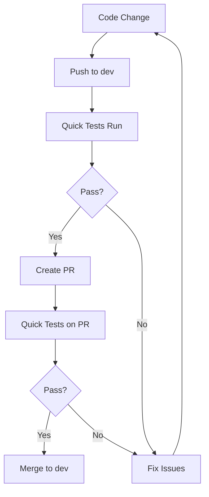
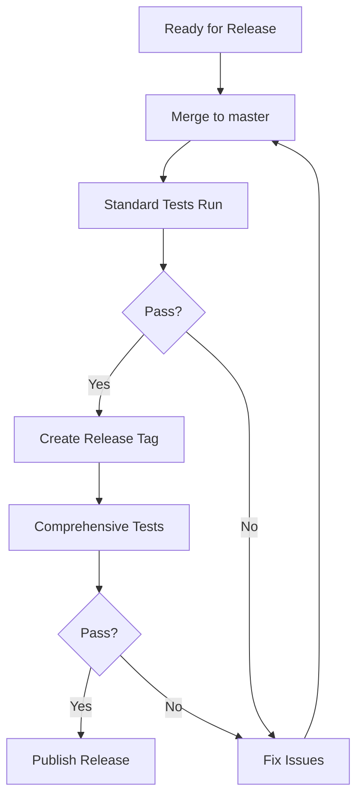

# GitHub Actions Workflows

This directory contains CI/CD workflows for the nanometanf pipeline, optimized with tag-based test execution.

## Available Workflows

### 1. Quick Test Validation (`test-quick.yml`)

**Purpose:** Fast feedback for pull requests and development branches

**Triggers:**
- Pull requests to `dev` or `master`
- Pushes to `dev` branch
- Manual trigger via workflow_dispatch

**Test Scope:** Core functionality with fast execution only
```bash
nf-test test --tag core --tag fast
```

**Duration:** < 5 minutes
**Use Case:** Pre-merge validation, rapid development feedback

**Tests Included:**
- Critical pipeline functionality
- Fast-executing module tests
- Core subworkflow validation
- Quick integration checks

---

### 2. Standard Test Validation (`test-standard.yml`)

**Purpose:** Daily validation of all core functionality

**Triggers:**
- Daily schedule (2 AM UTC)
- Pushes to `master` branch
- Manual trigger via workflow_dispatch

**Test Scope:** All core tests (fast + medium + slow)
```bash
nf-test test --tag core
```

**Duration:** ~15 minutes
**Use Case:** Nightly builds, pre-release validation

**Matrix Testing:**
- Nextflow version: 25.10.0
- Ubuntu latest

**Tests Included:**
- All core module tests (20 modules)
- All core subworkflow tests (9 subworkflows)
- All core pipeline tests (16 pipeline tests)

---

### 3. Comprehensive Test Validation (`test-comprehensive.yml`)

**Purpose:** Complete validation of entire test suite

**Triggers:**
- Weekly schedule (Sundays at 3 AM UTC)
- Release tags (`v*.*.*`)
- Manual trigger via workflow_dispatch

**Test Scope:** All tests (core + extended + experimental)
```bash
nf-test test
```

**Duration:** ~45 minutes
**Use Case:** Release validation, comprehensive quality assurance

**Tests Included:**
- All 20 module tests
- All 15 subworkflow tests
- All 22 pipeline tests
- Extended features
- Experimental features

---

### 4. Feature-Specific Test Validation (`test-feature.yml`)

**Purpose:** Targeted testing for specific feature areas

**Triggers:**
- Manual trigger via workflow_dispatch only

**Test Scope:** Configurable via workflow inputs

**Configuration Options:**

1. **Feature Area** (required):
   - `realtime` - Real-time processing features
   - `qc` - Quality control workflows
   - `classification` - Taxonomic classification
   - `basecalling` - Dorado basecalling
   - `barcode_discovery` - Barcode detection and demultiplexing
   - `validation` - BLAST validation
   - `resource_allocation` - Dynamic resource management
   - `error_handling` - Error handling and recovery

2. **Speed Filter** (optional):
   - `all` (default) - All test speeds
   - `fast` - Quick tests only (<30s)
   - `medium` - Medium duration (30s-5min)
   - `slow` - Long-running tests (>5min)

3. **Criticality Filter** (optional):
   - `all` (default) - All criticality levels
   - `core` - Core functionality only
   - `extended` - Extended features
   - `experimental` - Experimental features

**Example Usage:**
```bash
# Test real-time features (core + fast only)
Feature: realtime
Speed: fast
Criticality: core

# Test all QC functionality
Feature: qc
Speed: all
Criticality: all

# Test experimental resource allocation features
Feature: resource_allocation
Speed: all
Criticality: experimental
```

---

## Workflow Execution Strategy

### Development Workflow



### Release Workflow



---

## Tag-Based Test Execution

The workflows leverage the hierarchical tag system for intelligent test selection:

### Quick CI Example
```bash
# Execute only core + fast tests (95% time reduction)
nf-test test --tag core --tag fast --profile test,docker

# Typical execution:
# - 15-20 tests
# - ~3-5 minutes
# - High-priority validation only
```

### Standard CI Example
```bash
# Execute all core tests
nf-test test --tag core --profile test,docker

# Typical execution:
# - 35-40 tests
# - ~15 minutes
# - Complete core functionality
```

### Feature CI Example
```bash
# Execute real-time feature tests
nf-test test --tag realtime --tag core --profile test,docker

# Execute QC tests (all speeds)
nf-test test --tag qc --profile test,docker

# Execute experimental features only
nf-test test --tag experimental --profile test,docker
```

---

## Performance Benchmarks

| Workflow | Tests Executed | Duration | Time Saved | Use Case |
|----------|---------------|----------|------------|----------|
| **Quick** | 15-20 | ~5 min | 95% | PR validation |
| **Standard** | 35-40 | ~15 min | 75% | Daily builds |
| **Comprehensive** | 57 | ~45 min | Baseline | Release validation |
| **Feature** | Variable | Variable | 60-90% | Targeted testing |

**Baseline:** Running all tests without tag filtering takes ~45-60 minutes

---

## Best Practices

### For Developers

1. **Before creating PR:**
   ```bash
   # Run quick tests locally
   nf-test test --tag core --tag fast
   ```

2. **Feature development:**
   ```bash
   # Test specific feature area
   nf-test test --tag [your_feature] --tag core
   ```

3. **Before release:**
   ```bash
   # Run comprehensive suite
   nf-test test --profile test,docker
   ```

### For CI/CD

1. **PR checks:** Use Quick workflow for fast feedback
2. **Nightly builds:** Use Standard workflow for stability
3. **Pre-release:** Use Comprehensive workflow for complete validation
4. **Bug investigation:** Use Feature workflow for targeted testing

---

## Adding New Tests

When adding new tests, ensure proper tagging:

```groovy
nextflow_process {
    name "Test MY_NEW_MODULE"
    script "../main.nf"
    process "MY_NEW_MODULE"

    // Test Level & Component
    tag "module"
    tag "my_new_module"

    // Feature Area
    tag "my_feature_area"

    // Execution Speed & Criticality
    tag "fast"  // or "medium" or "slow"
    tag "core"  // or "extended" or "experimental"

    // Test Type (optional)
    tag "stub"
    tag "snapshot"

    test("Should do something") {
        // test implementation
    }
}
```

**Required Tags:**
- Level: `module`, `subworkflow`, or `pipeline`
- Component: Test name
- Feature: Feature area
- Speed: `fast`, `medium`, or `slow`
- Criticality: `core`, `extended`, or `experimental`

See `tests/TAGGING_GUIDE.md` for complete guidelines.

---

## Troubleshooting

### Tests failing in CI but passing locally?

1. Check Nextflow version match
2. Verify profile configuration (test,docker)
3. Review test logs in workflow artifacts

### Need to debug specific feature?

1. Use Feature workflow with targeted tags
2. Download test artifacts for detailed logs
3. Check `.nf-test.log` in artifacts

### Want to add new workflow?

1. Copy existing workflow template
2. Adjust test scope (tags)
3. Update timeout based on expected duration
4. Test with workflow_dispatch first

---

## Maintenance

### Updating Test Scope

If test execution times change significantly:

1. Re-categorize tests (fast/medium/slow tags)
2. Adjust workflow timeouts
3. Update this documentation with new benchmarks

### Adding New Feature Areas

When adding new feature tags:

1. Update `test-feature.yml` options list
2. Document in `tests/tags.yml`
3. Add examples to `tests/TAGGING_GUIDE.md`

---

**Last Updated:** 2025-11-09
**Tag System Version:** 1.0
**CI/CD Version:** 1.0
